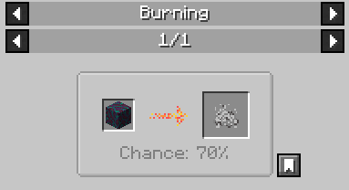

# Ash

**Item ID:** `chymistry:ash`

Ash is an item dropped when blocks in the world are destroyed by fire.

## Acquisition
Generated via the mod's custom `checkBurnOut` logic on `FireBlock` ([Incineration](Incineration)):

* **Recipe:** When a block in the `#minecraft:logs` tag is completely destroyed by fire, it has a **70% chance** to drop 1 Ash.

## Entity Properties
Ash item entities have custom despawn parameters:
* **Lifespan:** The dropped entity will despawn in exactly 30 seconds (600 ticks).
* **Proximity Limit:** The entity will only spawn if a player is within 64 blocks of the fire when the burnout occurs. (This can be toggled via the server config `require_player_for_ash`).
* The dropped entity is invulnerable to damage (e.g. fire/lava).

## Usage
Ash is used in [Production Composting](Production-Composting). Right-clicking a completely full **Level 7 Composter** with Ash will transform it into a Niter Soil Composter, which yields [Niter Dust](Niter-Dust) when right-clicked (or broken).
