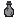

# Fluids & Extracts

Liquids and biological extracts.

*  **[Sea Water Bucket](Sea-Water-Bucket)** — Gathered from ocean biomes, used as a base component for specific recipes.
*  **[Animal Fat](Animal-Fat)** — A biological byproduct used in various mixtures.
*  **[Tinted Glass Bottle](Tinted-Glass-Bottle)** — A specialized container required to safely hold volatile liquids.
*  **[Elixir of Vitriol](Elixir-of-Vitriol)** — A consumable item that grants specific biological immunities.
