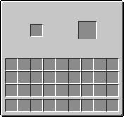

# Chymistry Wiki

**Chymistry** is an early-chemistry modification for Minecraft. It introduces multi-step resource processing and alchemical mechanics to the core gameplay loop.

Welcome to the official documentation. Select a category below or the sidebar to explore the specific systems, blocks, and items.

---

## 📖 Categories

| | |
| :---: | :--- |
|  | **[Mechanics](Mechanics)** The foundational processes utilized for resource synthesis. |
|  | **[Stations](Stations)** Functional workstations used to process materials. |
|  | **[Blocks](Blocks)** Structural and functional blocks. |
|  | **[Items](Items)** Powders, dusts, and solid reagents used in chemical reactions. |
|  | **[Fluids & Extracts](Fluids)** Liquids and biological extracts. |
|  | **[Status Effects](Effects)** Physiological effects applied to the player. |
