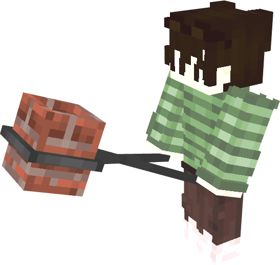

# Iron Tongs

**Iron Tongs** are heavy forging tongs utilized to safely handle, carry, and inspect heated **[Crucibles](Crucible)**.

  

## Mechanics

1. **Picking Up Crucibles**:
   * Right-click any placed Crucible with Iron Tongs in hand.
   * The crucible is lifted into the tongs, preserving its exact contents, internal temperature, smelting progress, and hazard status.
   * The player renders a custom two-handed carrying animation while holding the tongs.
2. **Portable Crucible GUI**:
   * Right-click in the air while carrying a Crucible to open its container interface directly from the tongs.
   * Items can be inserted, inspected, or removed on the move while data synchronizes in real time.
3. **Placing Down Crucibles**:
   * Crouch (Shift) + Right-click any valid surface block to place the crucible back down in the world.
4. **Thermal Tooltip Inspection**:
   * If a **[Thermometer](Thermometer)** is in the player's inventory, the Iron Tongs tooltip reveals the precise live heat rating of the held crucible (colored Red for positive heat, Cyan for sub-zero cold).

---

## Crafting

Crafted using Iron Ingots in a crafting table:

| Station | Grid Pattern | Materials | Output |
| :---: | :---: | :--- | :--- |
| **Crafting Table** | `I . I` `. I .` `I . I` | 5x Iron Ingot | **1x Iron Tongs** |
