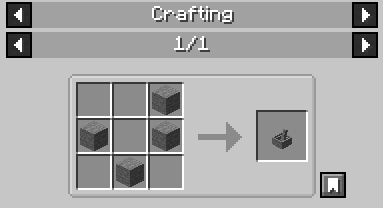
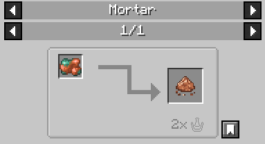
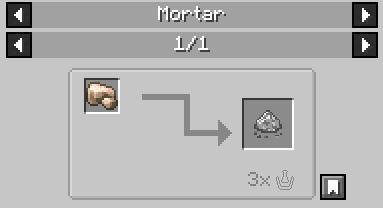

# The Mortar

The **Mortar** is an interactive crafting station utilized for processing and pulverizing materials into intermediate components.

## Mechanics

Unlike standard crafting stations, the Mortar requires manual player interaction over time.

1. **Input:** The Mortar accepts between 1 to 3 specific item inputs depending on the recipe.
2. **Processing:** Players must repeatedly click the block to advance the crafting progress.
3. **Speed Requirements:** Each recipe mandates a specific clicking frequency to succeed:
   *   **Slow:** Requires a deliberately paced click rate.
   *   **Fast:** Requires a rapid click rate.
   *   **Any:** The recipe progresses regardless of the click rate.

Failing to maintain the required click speed will trigger different consequences depending on the recipe being processed. While some safe recipes may simply halt progress until the correct speed is resumed, more volatile recipes can result in catastrophic failure; such as Gunpowder violently exploding if ground too quickly!

## Recipes

The following items can be processed in the Mortar:

### [Copper Dust](Copper-Dust)
1x Raw Copper ➔ 1x Copper Dust
* *Speed:* Any | *Presses:* 2

### [Iron Dust](Iron-Dust)
1x Raw Iron ➔ 1x Iron Dust
* *Speed:* Any | *Presses:* 3

### Gunpowder (`minecraft:gunpowder`)
1x Sulfur, 1x Charcoal, 5x [Niter Dust](Niter-Dust) ➔ 7x Gunpowder
* *Speed:* Slow | *Presses:* 5

