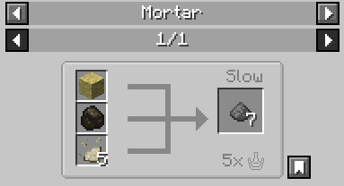

# Niter Dust

**Item ID:** `chymistry:niter_dust`

Niter Dust is an item registered by the mod. 

## Acquisition
Niter Dust is obtained through [Production Composting](Production-Composting). By right-clicking a completely full **Level 7 Composter** with **Ash**, it converts into a Niter Soil Composter which yields Niter Dust when right-clicked (or broken).

## Usage
Niter Dust is utilized in [The Mortar](Mortar) to craft Gunpowder (`minecraft:gunpowder`).

* **Recipe:** 1x `minecraft:sulfur`, 1x `minecraft:charcoal`, 5x Niter Dust
* **Click Speed:** Slow
* **Presses Required:** 5
* **Yield:** 7x Gunpowder
