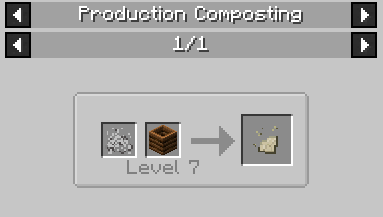

# Production Composting

Production Composting is the process of generating specific items by interacting with a completely full Composter right before it naturally produces Bone Meal.

## Process

When a Composter reaches **Level 7** (meaning it is completely full, but the Bone Meal is not yet ready to collect), players can interact with it using specific items to alter the composting matter and convert it into a new resource.

For example, right-clicking a Level 7 Composter with **[Ash](Ash)** will convert its contents into a **Niter Soil Composter**. When this modified composter is right-clicked (or broken), it will drop **[Niter Dust](Niter-Dust)** (and the Composter itself if broken) as the final product.

## Recipes

The following resources can be synthesized via Production Composting:

### [Niter Dust](Niter-Dust)
Apply **[Ash](Ash)** to a Level 7 Composter.

