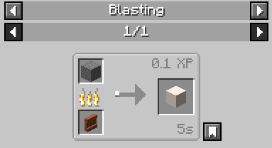

# Quicklime

**Block ID:** `chymistry:quicklime`

Quicklime is a solid block registered by the mod. 

## Acquisition
Quicklime is crafted by processing standard Stone (`minecraft:stone`) inside a vanilla **Blast Furnace**.

* Yields 1 Quicklime and 0.1 XP per stone block.

## Properties
* Copies properties directly from Stone.
* Has a hardness of 1.2 and blast resistance of 6.0.
* Requires the correct tool (Pickaxe) to drop itself when mined.

## Variants
Quicklime can be stonecut or crafted into the following structural variants:
* **[Quicklime Stairs](Quicklime-Stairs):** `chymistry:quicklime_stairs`
* **[Quicklime Slab](Quicklime-Slab):** `chymistry:quicklime_slab`
* **[Quicklime Wall](Quicklime-Wall):** `chymistry:quicklime_wall`
