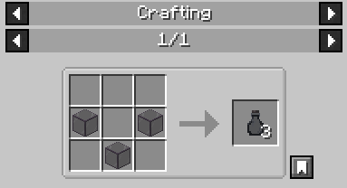

# Tinted Glass Bottle

**Item ID:** `chymistry:tinted_glass_bottle`

The Tinted Glass Bottle is an item registered by the mod. 

## Acquisition
Crafted in a Crafting Table using standard Tinted Glass (`minecraft:tinted_glass`) in a standard glass bottle "V" shape.

* **Yield:** 3x Tinted Glass Bottle.

## Mechanics
* Used as the return item when a player consumes an [Elixir of Vitriol](Elixir-of-Vitriol).
