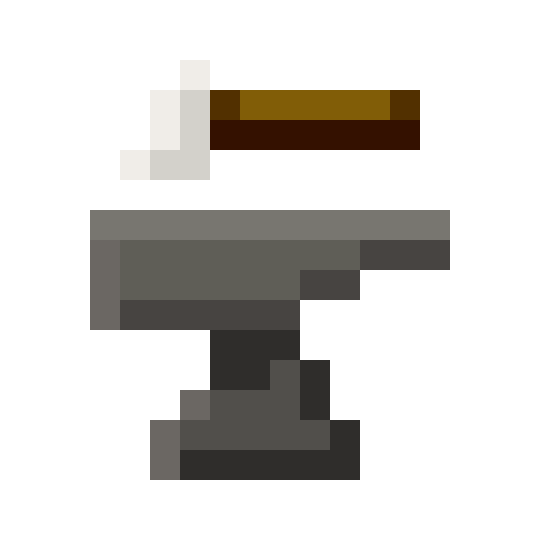
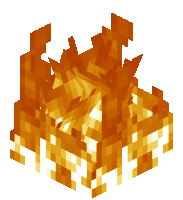
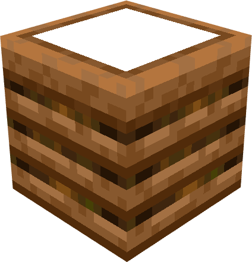
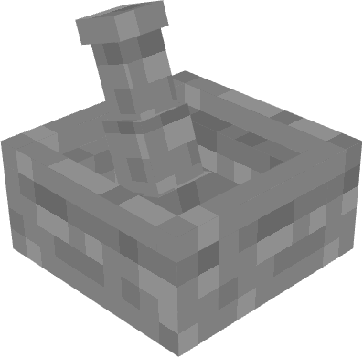
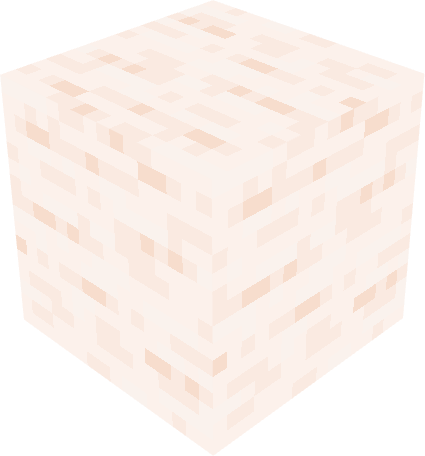
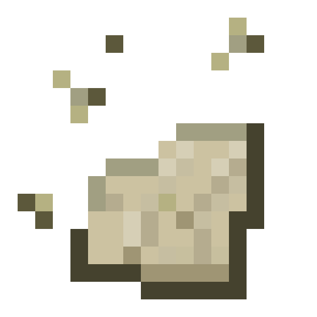
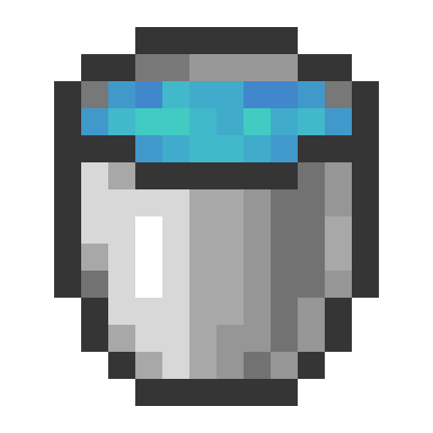
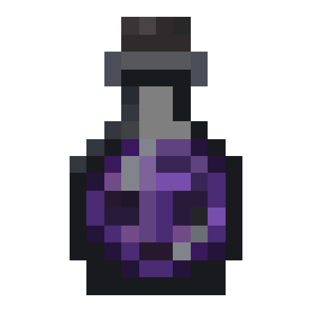
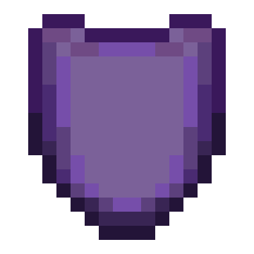

###  [Mechanics](Mechanics)
*  [Incineration](Incineration)
*  [Production Composting](Production-Composting)

###  [Stations](Stations)
*  [Mortar](Mortar)

###  [Blocks](Blocks)
*  [Quicklime](Quicklime)

###  [Items](Items)
*  [Ash](Ash)
*  [Copper Dust](Copper-Dust)
*  [Iron Dust](Iron-Dust)
*  [Niter Dust](Niter-Dust)
*  [Purified Gold Dust](Purified-Gold-Dust)
*  [Animal Fat](Animal-Fat)
*  [Tinted Glass Bottle](Tinted-Glass-Bottle)

###  [Fluids](Fluids)
*  [Sea Water Bucket](Sea-Water-Bucket)

###  [Potions](Potions)
*  [Elixir of Vitriol](Elixir-of-Vitriol)

###  [Effects](Effects)
*  [Vitriol Immunity](Vitriol-Immunity)
